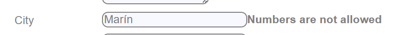
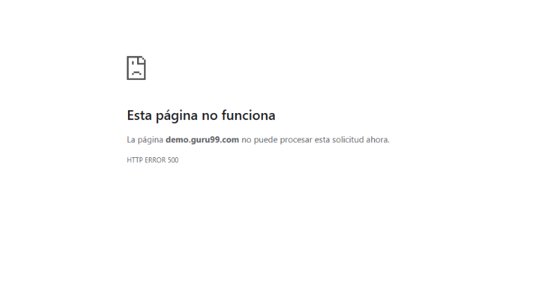

## Bug (createUser): City bloquea tildes y mensaje no cuadra

**Repro:**
Create User → City = `Marín` → submit.

**Actual:** no deja guardar y muestra  mensaje incorrecto “Numbers are not allowed”.  
**Expected:** aceptar tildes/ñ o, si no, mensaje correcto. "Special characters are not allowed".

**Evidencia:**  

## Bug (createUser): Mobile Number bloquea espacios y mensaje no cuadra

**Repro:**
Create User → Mobile Number = `+34 685321399` → submit.

**Actual:** no deja guardar con spacios o parentesis pero si "+" y muestra mensaje “Special characters are not allowed”.  
**Expected:** aceptar espacios o parentesiscomo separador en teléfonos o, si no se permiten, mensaje específico tipo: “Spaces are not allowed / Only digits and + are allowed”.

**Evidencia:**  

## Bug (createUser): Submit a veces devuelve HTTP 500

**Repro:**
Create User → rellenar formulario con datos válidos → Submit.

**Actual:** de forma intermitente, tras submit aparece página de error del navegador con **HTTP ERROR 500** y no se crea el usuario.  
**Expected:** el submit siempre debe completar el alta o, si hay fallo de backend, mostrar un mensaje controlado en la UI (no un 500 crudo).

**Foto Evidencia:**  

**Vídeo evidencia:**  
[createUser.mp4](/docs/videos/createUser500.webm)